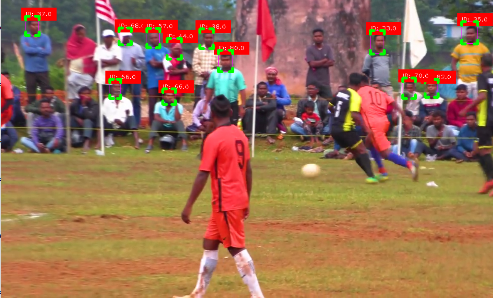

# Capture Unique Faces In A Blury Video

Hi my name is `Moses Daudu` 

# How the code works
Firstly you would need to input the youtube link to the football video you want to analyze.
The algorithm then creates three seperate folders which are images, result and vids.
The images folder is where all the face images will be saved, the result folder is where the output video will be saved, and the vids folder is where the youtube linked video will be dowloaded and saved.
The algorithm takes the saved video and runs it through a custom model that was trained on over 5000 face images. It then saves the images in the images folder and then lastly the face_recognition package is used to encode the images in the folder to identify images that are similar and then deletes the similar face images. 

It is important to mention that within the code, the sort algorithm already ensures that the same face is not given multiple IDs by increasing the max_age argument. This means that only unique IDs are captured, and in cases where the same face is given another ID, the face_recognition package ensures that those images are deleted.

## Run without Docker:

Create virtual environment and install all requirements
`pip install -r requirements.txt`

Run Python file
`python face_detect.py --youtube="https://youtu.be/JriaiYZZhbY"`
please note that you can change the youtube link to whatever link you may choose

Check the `result` folder for the video recording and check the `images` folder for the Unique face images

## Run with Docker:
Build the dockerfile
`docker build -t face_detect .`

Run the dockerfile
`docker run face_detect --youtube="https://youtu.be/JriaiYZZhbY"`

Check the `result` folder for the video recording and check the `images` folder for the Unique face images

